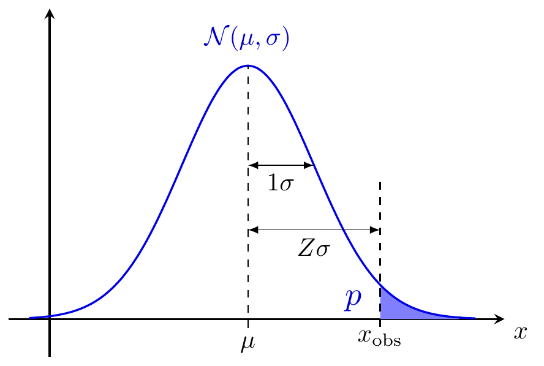

**TikZ là package dùng để vẽ hình rất mạnh trong (La)TeX, ta viết code để chỉ cho TeX cách thực hiện hình vẽ. Một số hình được vẽ bằng TikZ thuận tiện hơn vẽ bằng R. Do đó việc kế thừa các code mẫu đã có sử dụng TikZ vào trực tiếp trong file RMarkdown sẽ giúp bạn minh họa ý tưởng dễ dàng hơn và đỡ mất công vẽ lại trong R. Có 2 cách để dùng TikZ trong R như sau.**

### <span style="color: green">**Cách 1: Vẽ trực tiếp trong code chunk**</span>

**Sử dụng tham số `extra.preamble` cho phép đưa thêm package vào preamble của Tikz.**

**Nguồn: `https://tex.stackexchange.com/questions/640061/simple-cartesian-plane-with-straight-lines`**

```
{tikz, engine.opts = list(extra.preamble = c("\\usepackage{tikz}", "\\usepackage{tzplot}")), fig.width = 5, fig.height = 5}
```

```{tikz, engine.opts = list(extra.preamble = c("\\usepackage{tikz}", "\\usepackage{tzplot}")), fig.width = 5, fig.height = 5}
\begin{tikzpicture}
\tzaxes(-1,-1)(6,6){$x$}{$y$}
\tzticks*(-2pt:2pt){1,2,...,5}(-2pt:2pt){1,2,...,5}
\tzfn"AA"{\x-1}[-1:5]{$x-y=1$}[a]
\tzfn"BB"{-\x+3}[-1:4]
\tznode(0,3){$x+y=3$}[r]
\tzXpoint*{AA}{BB}{$P(2,1)$}[0]
\end{tikzpicture}
```

### <span style="color: green">**Cách 2: Dùng R để compile file `.tex` rồi insert file hình vào lại R**</span>

**Ví dụ bạn có file `.tex` này chứa code để vẽ hình, bạn có thể copy nội dung này chạy lại bên một phần mềm compile LaTex khác để kiểm tra (mình sử dụng TeXworks). Cách này mình recommend vì render độc lập, giúp kết quả ra ổn hơn cách 1.**

**Nguồn: `https://pgfplots.net/bell-curve/`**

```{r my_pre_example,echo=FALSE,include=TRUE,results='asis'}
knitr::opts_chunk$set(comment = NA)
cat('<pre>')
readLines("curve.tex") -> curve_tex
cat(curve_tex, sep = '\n')
cat('</pre>')
```

**Khi sử dụng dòng lệnh này ta sẽ render ra file ảnh `PDF` sau đó insert vào lại file báo cáo `HTML`.**

```{r, out.width="800px", warning=FALSE, message=FALSE}
library(pdftools)
library(tools)
tools::texi2dvi(file = "curve.tex", pdf = TRUE, clean = TRUE)
# knitr::include_graphics("curve.pdf")
# xfun::embed_file("curve.pdf")
pdftools::pdf_render_page("curve.pdf", dpi = 300) -> bitmap
png::writePNG(bitmap, "curve.png")

```

<!-- <iframe width="100%" height="800" src="curve.pdf"> -->

**Bạn có thể insert ở dạng file `PDF`**

{height=500px width=500px}

### <span style="color: red">**Cách 3: Vẽ bell curve bằng code R**</span>

**Nguồn: `https://community.rstudio.com/t/right-left-skewed-normal-distribution-curve-in-r-and-shading-the-area/60251/5`**

```{r, warning=FALSE, message=FALSE, fig.width=6, fig.height=6}
library(sn)
# generating data
exposures <- seq(from = -1,
                 to = 2,
                 by = 0.01)
probabilities <- dsn(x = exposures,
                     xi = 0.1,
                     omega = 0.3,
                     alpha = 5)

# calculating measures
measures <- quantile(x = exposures,
                     probs = c(0.40, 0.60))

# plotting distribution
plot(x = exposures,
     y = probabilities,
     type = "l")

# adding vertical lines at selected measures
abline(v = c(measures[1], measures[2]))

# shading areas below arithmetic mean, above upper 0.01 point and in between
polygon(x = c(min(exposures), exposures[exposures <= measures[1]], measures[1]),
        y = c(0, probabilities[exposures <= measures[1]], 0),
        border = NA,
        col = adjustcolor(col = "red",
                          alpha.f = 0.5))
polygon(x = c(measures[1], exposures[(exposures >= measures[1]) & (exposures <= measures[2])], measures[2]),
        y = c(0, probabilities[(exposures >= measures[1]) & (exposures <= measures[2])], 0),
        border = NA,
        col = adjustcolor(col = "green",
                          alpha.f = 0.5))
polygon(x = c(measures[2], exposures[exposures >= measures[2]], max(exposures)),
        y = c(0, probabilities[exposures >= measures[2]], 0),
        border = NA,
        col = adjustcolor(col = "blue",
                          alpha.f = 0.5))
```

## Tham khảo

1. `https://community.rstudio.com/t/loading-macros-from-external-file-into-tikz-chunks/128066`

2. `https://github.com/yihui/knitr/issues/1735`

## Source code

1. File [`tikz.Rmd`](https://tuhocr.netlify.app/cbr/tikz/tikz.Rmd)

2. File [`curve.tex`](https://tuhocr.netlify.app/cbr/tikz/curve.tex)

## Sơ kết

Trên đây là hướng dẫn vẽ TikZ trong R. Để học R bài bản từ A đến Z, thân mời Bạn tham gia <span style="color: green">**khóa học "HDSD R để xử lý dữ liệu"**<span style="color: blue"> **để có nền tảng vững chắc về R nhằm tự tay làm các câu chuyện dữ liệu của riêng mình!**

[**ĐĂNG KÝ NGAY: `https://www.tuhocr.com/register`**]{style="color: blue"}

